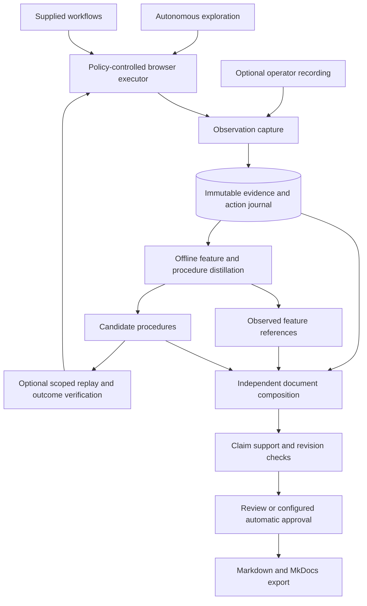

# Autonomous capture and offline distillation

Date: September 18, 2026

Status: accepted direction; first evidence-manifest and offline-distillation slice implemented

Execution plan: [Architecture migration development plan](development-plan.md)

## Product objective

Generate user documentation that explains what an application offers and how people perform operations. Starting URLs, authentication, and exploration scope should be sufficient to begin discovery. Users should not need to supply workflows to obtain useful documentation.

Preserve autonomous exploration while separating browser execution from feature interpretation and document writing. Capture evidence durably, then distill it into a feature inventory and illustrated guides. Failed model calls should be recoverable without repeating successfully captured browser interactions.

“Offline” means independent of the target application and its browser session. A configured cloud model still requires provider network access; this design does not promise local-only inference.

## Existing foundation and intended changes

The existing application already captures Playwright ARIA snapshots and full-page screenshots, extracts selected controls, persists states and transitions, supports heuristic and model planners, and composes documentation from stored verification evidence. This is an incremental migration, not a replacement browser stack.

| Area | Existing behavior | Target behavior |
| --- | --- | --- |
| Observation | ARIA snapshots, selected DOM controls, screenshots | Versioned, bounded semantic views with full evidence retained |
| Exploration | Heuristic or live model ranking; planner errors can stop discovery | Deterministic scheduling by default; optional bounded assistance with fallback |
| Interpretation | Feature interpretation participates in planning | Feature grouping and procedure drafting primarily process saved evidence |
| Documentation | Guides depend on passed workflow verification | Feature references use observed evidence; procedural outcome claims require demonstrated evidence |
| Recovery | Selected discovery stop reasons can resume | Capture and processing stages have independent checkpoints and retries |
| Inputs | Supplied workflows and autonomous discovery | Both remain; operator recordings become another evidence source |
| Approval | `docs-generate` auto-approves eligible verified documents | Preserve that convenience, with explicit eligibility for each document kind |

These target behaviors must not be described as available CLI options before implementation.

## Components and data flow

These are modules and persistent stages in one Python application. A distributed queue, additional browser framework, or new service is not required. Human actions are recorded as operator actions; recording does not imply that application policy authorized those actions or that automated replay is permitted.

## Capture and autonomous exploration

Use accessibility snapshots as the primary semantic representation. Retain selected DOM attributes for targets, links, custom controls, frame scope, and poorly labelled interfaces. Use screenshots for visual context and documentation illustrations. No single representation proves that all controls were discovered.

Playwright provides [ARIA snapshots](https://playwright.dev/python/docs/aria-snapshots) and [full-page and element screenshots](https://playwright.dev/python/docs/screenshots). Snapshot size varies with content; there is no assumed 200–400-token page size. Store the complete sanitized observation and derive bounded, region-specific model views. Record truncation, omitted regions, and unresolved controls explicitly.

The default scheduler prioritizes unexplored navigation, expandable menus, tabs, dialogs, and representative forms. Bound pagination and repeated record variants, retain the pending frontier, and report exclusions. Hidden menu links are hints for discovery, not evidence that a user can currently activate them; open the relevant menu and capture the visible path where feasible.

Persist action intent before execution and capture before/after observations with the result. Stabilize captures through bounded application-relevant waits. Store viewport, locale, role, URL, frame identity, time, application version when known, and screenshot references. Use full-page capture for context and scoped images when they improve the guide. A successful click alone does not prove an operation succeeded.

Optional live AI assistance handles ambiguous controls or ordering. Requests contain bounded candidate batches and selected semantic regions, not an obligation to produce verbose metadata for every control on a large page. Apply a timeout, retry ceiling, and separate usage budget. Invalid output or provider failure records an assistance failure and returns scheduling to deterministic code. If code cannot proceed within policy, retain the branch as unresolved and continue other branches. A failed model call must never expand permitted actions.

This reduces live inference dependency; it does not eliminate session expiry, conditional navigation, or the need to restore prerequisites when moving between branches.

## Evidence bundles and processing checkpoints

Introduce a versioned capture-bundle manifest referencing existing immutable observations, artifacts, actions, and transitions rather than copying them into a second database. A manifest records:

- Project, role, capture run, origin (autonomous, supplied, or operator), and schema version.
- Ordered observation/action references and action outcomes, including uncertainty.
- Artifact hashes, sensitivity/redaction status, and target/environment metadata.
- Coverage scope, pending branches, capture stop reason, and whether capture is partial.
- Named input references and prerequisite relationships, without embedded credentials.

A stopped or paused capture can produce a partial bundle. Continued capture produces a new manifest revision; processing an earlier revision uses a fixed input set. Distillation never silently consumes additional observations added after its checkpoint.

Persist processing attempts separately from browser runs. Record stage, manifest hash, model and prompt versions, configuration hash, usage, per-item status, and output references. Key completed work by those inputs so a retry reuses successful items. New prompts or evidence produce new revisions and leave previous reviews intact.

Distillation, composition, and export run without opening the target browser or loading its authentication. Each has its own budget and failure reason. Optional replay is a separate browser stage that creates new evidence. Processing failure must not overwrite a capture run's stop reason or erase its frontier.

## Offline interpretation and writing

Distillation groups observations into user-facing features, maps their navigation paths, selects representative screenshots, and proposes procedures from recorded transitions. Process bounded groups by area and role, then merge with provenance; do not send an entire large run as one prompt. Preserve record-specific context when it changes behavior.

Keep unresolved branches and unsupported claims in coverage reports. The model may propose a missing step for future capture, but cannot insert it into a demonstrated path. Owner-supplied business rules retain explicit provenance and do not become browser-observed facts.

Composition uses persisted distillation outputs and selected evidence. Produce feature references describing purpose, access path, visible fields, and available controls; produce task guides describing prerequisites, ordered instructions, and supported outcomes. Screenshots and links must reference actual retained artifacts. Model or renderer failures can retry individual documents without rerunning discovery.

## Evidence strength and publication

Evidence status, replay verdict, and editorial approval are separate attributes.

| Evidence level | Supported content | Limit |
| --- | --- | --- |
| Observed | Feature reference, visible controls, labels, layout and captured navigation | Does not establish successful submission, persistence, or hidden business rules |
| Demonstrated | Procedure whose recorded actions and applicable outcome evidence support each claim | Does not claim independent repeatability; missing outcome evidence leaves it a draft |
| Replay-verified | Exact procedure revision with a passed independent replay under recorded prerequisites | Verification applies only to the recorded role/environment and supported outcomes |

An imported operator recording begins as captured evidence, not automatically as a demonstrated or verified procedure. Validate action continuity, target identity, prerequisites, and observed outcomes before assigning support. Unsupported business outcomes stay inconclusive.

Existing guides keep their verification requirements during migration. Initially enable the new export path only for observed feature references with validated claim support and an exact-revision approval. Preserve the existing automatic approval behavior for currently eligible verified guides. Automatic approval of demonstrated-only procedures is deferred; they require explicit review and must disclose their evidence scope. Feature-reference automatic approval must be a separately documented policy, not an accidental consequence of adding a new document type.

Review approves an exact document revision; it does not upgrade the evidence level. Changed evidence, procedures, or content invalidate eligibility as appropriate. Published user prose should explain operations plainly; detailed verification diagnostics belong in the review and coverage artifacts.

## Parameterized inputs and application state

Declare typed input variables before execution, including validation constraints, generation strategy, reuse scope, and any prerequisite records. Generate a fresh execution identifier for a new authorized replay; keep bound values stable within that execution and when reconciling interrupted actions. Retain created-record references for later steps. Sensitive values use private references and redacted presentation examples.

Unique inputs can prevent duplicate-name collisions. They cannot restore deleted records, undo status changes, supply permissions, or establish relationships. Distillation may suggest parameterization, but suggestions require validation before execution and must not rewrite historical evidence as though generated values were used originally.

Each procedure declares a preparation strategy: no preparation, existing representative data, operator-prepared state, or an explicitly configured environment adapter. Cleanup is optional and scoped, with failures recorded. Never treat browser navigation as a database reset or blindly repeat a write whose outcome is uncertain. Missing prerequisites block that procedure while other documentation can continue.

## Recovery, budgets, and compatibility

Keep action, state, depth, and elapsed capture budgets separate from assistance and offline model budgets. A capture time limit does not describe the duration of an entire capture-to-export operation. Persist effective configuration and changes on resume. Authentication recovery reopens capture; an offline model failure retries only processing.

Support legacy planner-failed runs after validating their saved frontier and reconciling any interrupted attempt. Changing model settings is not authorization to repeat an uncertain write. Old runs without sufficient retained evidence remain readable and receive an explicit incompatibility reason if a new stage cannot consume them.

Retain existing CLI commands and project files. The one-command experience should orchestrate the independent stages and report which stage failed, what was saved, and the exact supported retry command. Additive migrations and defaulted schema fields preserve existing guides, approvals, run identifiers, and exports. CLI names for new standalone stages are proposed in the development plan, not shipped behavior.

## Evaluation and limits

Measure menu/feature recall, unexplored branches, supported document coverage, outcome support, operator effort, capture latency, model usage, and retry cost separately. A large number of states is not evidence of good documentation coverage.

Evaluate nested menus, poorly labelled controls, frames, long tables, expired sessions, model failures, and uncertain writes using the local fixture. Compare representative Chainlit and Lodur captures under matched scopes and budgets when authorized access is available. Do not claim full coverage of arbitrary websites, deterministic prose, or reproducible writes solely because screenshots and unique inputs are automated.
