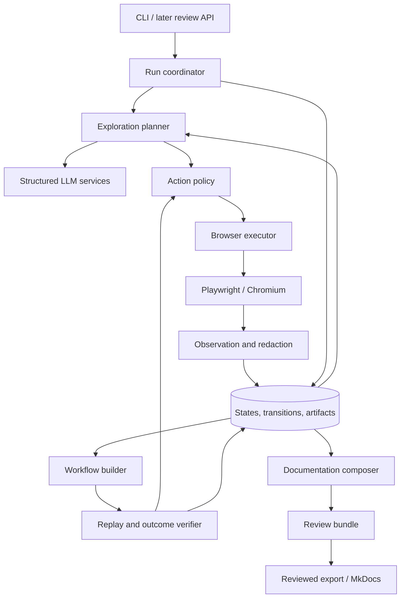

# Architecture and development plan

Date: September 14, 2026  
Status: historical baseline; superseded by the September 18, 2026 architecture linked below

Companion: [Website documentation case study](feasibility-case-study.md)

Current architecture: [Capture and offline distillation](../architecture.md).

Current execution roadmap: [Architecture migration development plan](../development-plan.md).

This document preserves the original architecture, library rationale, and baseline acceptance targets. Its statements about unimplemented code, delivery estimates, mandatory verification for all documentation, and the live planning loop describe the original proposal, not the current implementation or new design. Phase 1–4 implementation records describe delivered work. The linked architecture and migration plan take precedence for new development; the [original phased plan](original-development-plan.md) remains a historical checklist.

## 1. Recommended direction

Build a modular Python application with a CLI, a resumable execution engine, and a persistent record of browser observations. Use Playwright directly for browser control, Pydantic AI for structured model interactions, SQLite for operational data, and Markdown/MkDocs for documentation output.

The central product asset is a set of verified user workflows linked to supporting evidence. The LLM proposes exploration actions, interprets observations, and drafts documentation. Application code owns execution, permissions, budgets, persistence, verification status, and export eligibility.

Begin with one local worker and one browser session at a time. Add a review API and independently launched worker during the pilot. Keep a single codebase and shared domain services; separate processes do not require microservices.

Library capabilities were checked against official documentation on the date above. Technology choices, interfaces, acceptance targets, and estimates below are design proposals. No application benchmark has yet been performed.

## 2. Initial scope and assumptions

The first release targets one conventional web application, Chromium, a desktop viewport, one documentation language, and two user roles. It supports authenticated navigation, lists, tabs, dialogs, forms, validation messages, and a small set of explicitly configured write operations in a disposable environment.

Expected operator inputs are starting URLs, role-specific authentication, permitted operations, representative test data, and a product-owner workflow inventory for evaluation. The application can run unguided discovery, but its evaluation inventory must remain separate from the model input in that mode.

Initial output is a local review bundle containing a feature inventory, workflow guides, screenshots, coverage gaps, and evidence references. Reviewed guides can be exported as a static documentation site. Hosting or publishing that site is a separate integration.

Defer arbitrary production writes, automated CAPTCHA solving, comprehensive canvas interaction, all possible role/feature-flag combinations, fully automatic publication, and hosted multi-tenancy. These deferrals should appear as explicit capability limits, not silent omissions in coverage reports.

## 3. Component architecture



The arrows describe application data flow, not a requirement to introduce separate services. In particular, exploration and verification use the same policy-controlled execution path.

| Component | Responsibility | Must not own |
| --- | --- | --- |
| Run coordinator | Run lifecycle, checkpoints, cancellation, stage transitions, usage accounting | Site-specific UI selectors |
| Exploration planner | Frontier selection, novelty ranking, loop avoidance, stop reasons | Unchecked browser execution |
| LLM services | Action proposals, feature grouping, workflow hypotheses, structured document drafts | Permission decisions or authoritative verification status |
| Action policy | Check operation, target, environment, role, and configured permissions | Inferring authorization from page instructions |
| Browser executor | Resolve targets, perform bounded operations, capture execution results | Documentation prose |
| Observation service | Capture structural state, screenshots, metadata, and sanitized model input | Business-rule invention |
| State repository | Observations, canonical states, transitions, frontier entries, provenance | Browser handles or model conversation as the sole state |
| Workflow builder | Assemble candidate user goals and replayable paths | Marking an unexecuted path verified |
| Replay verifier | Restore prerequisites, execute steps, check outcomes, record verdicts | Blind retries of uncertain writes |
| Documentation composer | Turn approved evidence into structured guides and Markdown | Executing generated code or publishing remotely |
| Review/export service | Record edits and decisions, validate dependencies, export approved revisions | Silently overwriting reviewed content |

## 4. Libraries and runtime

Use Python 3.12 as the initial compatibility baseline, subject to the phase 0 installation check. Commit `pyproject.toml` and `uv.lock`; pin the browser image/binaries with the tested Playwright version. Resolve exact compatible package versions during setup rather than inventing a version matrix in this document. CI uses a locked environment. [uv locking and synchronization](https://docs.astral.sh/uv/concepts/projects/sync/).

### Core dependencies

| Library / tool | Decision and purpose | When introduced |
| --- | --- | --- |
| [Playwright](https://playwright.dev/python/docs/intro) | Async Python API for Chromium control, screenshots, authentication, and traces | Phase 0 |
| [Pydantic](https://docs.pydantic.dev/latest/) | Versioned configuration, actions, observations, workflows, and document schemas | Phase 1 |
| [pydantic-settings](https://docs.pydantic.dev/latest/concepts/pydantic_settings/) | Runtime settings and environment-based secret references | Phase 1 |
| [Pydantic AI](https://pydantic.dev/docs/ai/overview/) | Typed model calls, constrained outputs, provider integration, and test doubles | Phase 2 |
| [SQLAlchemy](https://docs.sqlalchemy.org/en/20/) | Explicit relational models and repositories; SQLite initially | Phase 1 |
| [Alembic](https://alembic.sqlalchemy.org/en/latest/) | Versioned database migrations | Phase 1 |
| [Typer](https://typer.tiangolo.com/) | CLI commands and operator feedback | Phase 1 |
| [Jinja2](https://jinja.palletsprojects.com/en/stable/) | Fixed application-owned document templates | Phase 4 |
| [MkDocs](https://www.mkdocs.org/) | Build reviewed Markdown and assets into a static documentation site | Phase 4 |
| [FastAPI](https://fastapi.tiangolo.com/) | Local review API and lightweight review pages; also serves the development fixture | Phase 0 tests; phase 5 runtime |
| [Uvicorn](https://github.com/Kludex/uvicorn) | ASGI server for the fixture and later review service | Phase 0 tests; phase 5 runtime |
| [HTTPX](https://www.python-httpx.org/) | Test fixture/API client; optional application-specific setup and outcome adapters | Phase 0 for tests |

Use standard-library `asyncio`, `tomllib`, `hashlib`, `logging`, and `pathlib` where sufficient. The first repository implementation can use short synchronous SQLAlchemy transactions between browser/model awaits; never hold a transaction open across external calls. If measured database blocking warrants async access, add the appropriate driver and use a separate session per task. SQLAlchemy documents that an `AsyncSession` must not be shared across concurrent tasks. [Async SQLAlchemy guidance](https://docs.sqlalchemy.org/en/20/orm/extensions/asyncio.html).

The review server runs with pinned Uvicorn. Browser jobs run in the worker process, not request handlers or FastAPI `BackgroundTasks`; the latter is not the application's durable job mechanism. [FastAPI background task guidance](https://fastapi.tiangolo.com/tutorial/background-tasks/).

See the [library adoption plan](original-development-plan.md#python-library-adoption-plan) for package names, dependency groups, optional extras, and phase-specific validation.

### Development and testing dependencies

| Tool | Purpose |
| --- | --- |
| [pytest](https://docs.pytest.org/en/stable/) | Unit, repository, browser integration, and end-to-end tests |
| [pytest-asyncio](https://pytest-asyncio.readthedocs.io/en/stable/) | Async fixtures and application tests |
| [Hypothesis](https://hypothesis.readthedocs.io/en/latest/) | Property tests for URL handling, fingerprints, budgets, and lifecycle invariants |
| [Ruff](https://docs.astral.sh/ruff/) | Linting and formatting |
| [mypy](https://mypy.readthedocs.io/en/stable/) | Static checking of domain types and adapter contracts |
| Pydantic AI test models | Scripted model responses and deterministic failure cases |

Use Playwright's async API directly in browser fixtures so tests exercise the application's own executor. Do not maintain a second browser automation stack solely for testing. Pydantic AI provides model substitution facilities for isolated tests. [Pydantic AI testing](https://pydantic.dev/docs/ai/guides/testing/).

### Alternatives and adoption triggers

| Alternative | Decision |
| --- | --- |
| Stagehand | Run a bounded phase 0 comparison. Adopt only if it meets the same observation, policy, evidence, and replay contracts with materially better results. Its current APIs are Playwright-style, not interchangeable Playwright objects. |
| Playwright MCP | Defer until external MCP clients are a requirement. Any future adapter must pass the same execution-policy tests. |
| Browser Use | Optional exploration experiment if custom planning underperforms; do not add a second unconstrained action loop. |
| Crawljax | Reconsider if measured state-discovery gaps justify a Java service. |
| Crawlee / Crawl4AI | Add when broad URL crawling or existing-content ingestion becomes a measured bottleneck. |
| LangGraph | Reconsider if explicit stage/checkpoint code becomes difficult to maintain; the initial state machine is small enough to own. |
| PostgreSQL / external queue / object storage | Introduce when multiple worker hosts or hosted access are required. SQLite is not the distributed job queue. |
| Graph/vector database | Defer. Relational state/edge tables and bounded graph traversal are sufficient initially. |

See the [case-study comparison](feasibility-case-study.md#tool-comparison) for sources and tradeoffs. [Stagehand v4 documentation](https://docs.stagehand.dev/v4/first-steps/introduction) describes its current browser architecture.

## 5. Domain model and storage

Separate immutable observations from deduplicated states: two observations may map to the same state without discarding their evidence.

| Entity | Essential fields / purpose |
| --- | --- |
| Project | Target identity, scope configuration, audience, storage location |
| RoleProfile | Role name, authentication reference, environment/configuration identity |
| Run | Project, role/scenario matrix, status, stage, limits, usage, application/browser/model/prompt versions |
| Observation | Run, role, scenario, URL, time, page/frame identity, structural snapshot, artifact references |
| State | Canonical fingerprint, fingerprint algorithm version, representative observation; scoped by role and scenario |
| ActionAttempt | Before observation, typed action, policy decision, execution status, timestamps, outcome uncertainty |
| Transition | Source/target states, attempt reference, observed result; an edge can return to the same state |
| FrontierItem | State, candidate operation, priority, path prerequisites, attempt count, status, skip/block reason |
| Feature | Candidate capability, supporting observations, role scope, unresolved questions |
| WorkflowRevision / Step | Goal, role, fixture prerequisites, ordered semantic targets, input references, outcome predicates |
| Verification | Exact workflow revision, fixture/browser/app version, step results, final predicates, pass/fail/inconclusive |
| Artifact | Relative path, content hash, media type, sensitivity class, redaction metadata, retention status |
| DocumentRevision / Claim | Structured guide, workflow dependencies, claim-level evidence references, review status |
| ReviewDecision | Revision hash, actor, decision, edits, timestamp; tied to the exact reviewed revision |
| UsageEvent | Stage/model, token/image usage where reported, duration, configured cost estimate, attempt reference |

Use foreign keys and explicit uniqueness constraints. Keep the state graph in relational tables; persist JSON only for versioned variable payloads. Store artifact bytes outside the database using project-scoped paths, and verify content hashes when loading evidence for export.

Write artifacts to a temporary file and atomically finalize them before committing their database reference. A crash may leave an unreferenced artifact; cleanup can reclaim it after a grace period. A failed artifact write must not produce a verified result pointing to missing evidence.

Suggested runtime layout, excluded from version control:

```text
.web2doc/
  projects/<project-id>/
    state.sqlite3
    private/auth/<role-id>.json
    private/traces/<run-id>/
    artifacts/<run-id>/
    review/<document-revision>/
    exports/<approved-revision>/
```

Browser storage state and diagnostic traces are private artifacts. Do not include them in the generated site, model context, or normal logs. Retention controls must keep referenced evidence or mark dependent revisions as no longer verifiable when evidence is removed.

## 6. Execution contracts and algorithms

### Browser and model interfaces

Define narrow Python protocols rather than exposing browser objects throughout the codebase:

```text
BrowserAdapter:
  start(role, environment) -> BrowserSession
  observe(session) -> ObservationDraft
  execute(session, approved_action) -> ExecutionResult
  close(session)

ModelService:
  propose_actions(sanitized_observation, frontier_summary) -> ActionProposal[]
  propose_workflows(evidence_bundle) -> WorkflowDraft[]
  compose_document(verified_bundle, editorial_brief) -> DocumentDraft

EnvironmentAdapter:
  prepare(scenario) -> FixtureReceipt
  check_outcome(predicate, fixture_receipt) -> OutcomeResult
  reset(fixture_receipt)
```

`EnvironmentAdapter` is optional for observation-only targets. The default verifier uses browser-visible predicates; fixture APIs and backend checks are trusted site-specific integrations, unavailable as arbitrary LLM tools.

Actions form a closed, validated union: navigate, click, fill, select, press an allowed key, scroll, and wait for a specified condition. Expand only when covered by policy and adapter tests. The model cannot submit arbitrary Python, JavaScript, shell commands, or filesystem paths. Observation extraction may use application-owned JavaScript.

An action target includes page/frame scope and a semantic locator specification, such as role/name, label, or a stable site-provided test identifier. Save CSS fallback only when needed. Reject ambiguous matches and stale references; observe again before replanning. Prefer Playwright locators and explicit bounded waits over fixed sleeps. Structural observation can use locator ARIA snapshots plus selected DOM attributes. [Playwright locator API](https://playwright.dev/python/docs/api/class-locator).

### Exploration loop

1. Load the run configuration and verify required authentication and fixture readiness.
2. Observe the current browser state and produce a sanitized model view.
3. Compute a role/scenario-scoped state fingerprint and persist the full observation independently.
4. Enumerate visible candidate controls in code; ask the model to rank unfamiliar operations and supply rationale/input requirements.
5. Prioritize unexplored navigation and new capabilities, with per-state limits and explicit skip reasons.
6. Check the proposed action against policy and remaining budgets.
7. Persist an action intent, execute one action, observe its outcome, and commit the attempt/transition.
8. Update the frontier and repeat until it is exhausted, a budget is reached, authentication is needed, or progress is blocked.

Suggested initial configurable limits are 200 actions, 100 canonical states, path depth 12, and 30 minutes per run. These are tuning defaults, not coverage claims. Model requests and output tokens also have limits. Reserve capacity before model calls; stop if usage reporting is unavailable and a conservative bound cannot be enforced. A configured monetary budget remains an estimate based on recorded rate assumptions.

Store an explicit reason when a run stops. Exhausting a bounded frontier means no remaining permitted candidates within that run's scope, not that the website is fully documented.

### State identity and path restoration

Fingerprint normalized route, role, scenario/configuration, active dialog/tab, meaningful control structure, and selected semantic values. Remove volatile timestamps and configured record identifiers. Preserve errors, disabled states, empty/populated conditions, and relevant query parameters. Version normalization rules; changes require remapping rather than silently reusing old identities.

A browser observation is not a restorable backend snapshot. To explore another branch, replay a known prefix from its fixture checkpoint and confirm prerequisites. Browser back-navigation alone is not a reset. If restoration is unavailable, mark the branch blocked and retain the evidence already gathered.

### Policy and data boundaries

The default mode restricts execution to configured observational operations. Even a click or GET request can have effects; do not describe this mode as a universal read-only guarantee. Enable writes only for explicit operations and fixtures in a disposable environment. Unknown operations are skipped or queued for a scoped operator decision. Existing decisions remain valid within their recorded run/role/operation scope.

Keep navigation origins and supporting resource/authentication origins distinct. Check redirects and new tabs, not just initial URLs. Browser request interception supports enforcement, but network containment for untrusted targets needs worker-level egress restrictions as well. A hosted deployment must prevent access to unintended internal/metadata endpoints; explicitly configured private target networks remain supported.

Treat all page content as data. Credentials are injected by trusted code through references, never included in model prompts. Redact DOM text and mask known sensitive screenshot regions before model transmission; if sanitization cannot be established, withhold that artifact or require synthetic data. Masking is not proof that arbitrary screenshots contain no sensitive information.

### Persistence and crash recovery

Run lifecycle: `queued -> running -> awaiting_review -> completed`, with `paused`, `cancelled`, and `failed` as explicit alternatives. Store the processing stage separately: discovery, workflow building, verification, composition, and export. Resuming `paused` returns to the saved stage after prerequisites are rechecked. Budget exhaustion can yield a partial review bundle with a recorded stop reason.

Action lifecycle: `planned -> allowed -> executing -> succeeded/failed/uncertain`; policy may instead mark an attempt `denied` or `needs_input`. Persist intent before interaction. If the browser or worker dies after interaction starts, a timeout does not prove the operation failed.

On restart, reconcile executing attempts against observable outcomes. Never automatically repeat an uncertain write. Use trusted outcome checks, fixture reset, or operator resolution. Exactly-once browser effects cannot be guaranteed through database transactions. Model and observation calls can use bounded retries; retrying browser actions requires operation-specific reasoning.

Phase 1 allows only one worker per project, enforced by a project execution lock. Phase 5 adds a durable jobs table and process heartbeat while preserving that limit; before restarting a job, establish that the old executor is stopped. Parallel browser contexts do not isolate shared backend data. Multiple hosts and lease fencing require a later PostgreSQL/queue design and separate tenant fixtures.

### Verification and documentation rules

Verification checks both step execution and final outcomes. Predicates may include an expected visible record with a generated unique name, a persisted value after reload, an error state for invalid input, or a trusted application-adapter result. LLM interpretation may suggest predicates but does not replace their execution or owner validation.

A workflow is verified only for its recorded role, scenario, revision, and observed application version/time. Alternative paths and business rules remain unverified unless separately supported. Use `inconclusive` when the outcome cannot be established.

Have the model produce a typed document AST: goal, prerequisites, ordered steps, expected results, screenshots, troubleshooting, and claim evidence IDs. Render with application-owned templates. Evidence-ID existence is only a structural check; factual support also needs review. Do not execute model-generated templates, enable arbitrary HTML/scripts, or let text choose output paths. Validate link schemes and escape untrusted content before preview.

Draft previews may contain explicitly marked gaps. Reviewed exports require resolved evidence references, passing applicable workflow verification, and a review decision for the exact revision. Unverified features belong in the coverage report. Manual edits are versioned and retained; regeneration creates a new revision for comparison.

## 7. Operator interface

The CLI is the first complete interface. Proposed commands, not yet implemented:

```text
web2doc init <project>
web2doc auth login --project <id> --role <role>
web2doc run --project <id> --config project.toml
web2doc status <run-id>
web2doc pause <run-id>
web2doc resume <run-id>
web2doc verify <run-id> --workflow <id>
web2doc docs build <run-id>
web2doc review <document-revision>
web2doc export <approved-revision> --output <directory>
web2doc compare <baseline-run> <new-run>
```

`review` initially creates/opens a local bundle and records an explicit decision against its revision hash. Phase 5 adds review pages for evidence, corrections, blocked actions, and approval. Login can pause for the operator to complete SSO/MFA in a headed browser.

The later API exposes project/run creation, run events, cancellation/resume, workflow verification requests, evidence retrieval, document revisions, and review decisions. Mutation requests use idempotency keys where appropriate. The API writes durable jobs and returns a job ID; it does not keep an HTTP request open for the crawl. Polling status is sufficient initially.

Bind the review service to loopback by default, validate host/origin and protect mutations against cross-site requests. Network-exposed access requires authentication and project-scoped authorization before deployment.

## 8. Suggested repository structure

```text
pyproject.toml
uv.lock
src/web2doc/
  cli.py
  config.py
  domain/           # Typed entities, statuses, action and document schemas
  orchestration/    # Stage runner, jobs, recovery, limits
  browser/          # Adapter protocol, Playwright executor, locators
  discovery/        # Observation, fingerprints, frontier, feature proposals
  policy/           # Scope, operations, redaction, operator decisions
  llm/              # Pydantic AI services, versioned prompts, usage
  workflows/        # Candidate paths, replay, outcome predicates
  documentation/    # Composition, claim validation, templates, export
  storage/          # SQLAlchemy models, repositories, artifacts
  api/              # Added in phase 5
  adapters/         # Explicit target-specific fixtures and checks
migrations/
tests/
  unit/
  integration/
  browser/
  e2e/
  fixtures/site/    # Local test application with resettable backend
evals/
  cases/            # Held-out inventories and expected outcomes
  runners/
docs/
```

Treat this as responsibility boundaries, not a requirement to create every directory before there is code for it.

## 9. Development phases and exit criteria

Estimates assume one experienced engineer, a target owner available for feedback, and an accessible staging environment. Each phase depends on the preceding phase's exit criteria. The phase estimates total 30–45 working days (6–9 engineer-weeks); budget 8–12 weeks with integration and review contingency. The technical prototype ends after phase 3 at roughly 3–5 weeks, and the first documentation-producing milestone ends after phase 4 at roughly 4–6 weeks. This expands the case-study prototype estimate to include explicit recovery, verification, and review work.

### Phase 0 — Define the benchmark and validate the browser choice

Effort: 2–3 days.

Deliver a local fixture application with two roles and an initial subset of ten documented workflows. Include lists, a dialog, validation, delayed responses, and a controlled mutation. Establish reset endpoints and an independent expected-outcome inventory. Confirm the Python/library installation matrix and run a small Playwright-versus-Stagehand comparison under equivalent budgets.

Testing: execute the same representative navigation, form, screenshot, and outcome checks through each candidate. Inspect action control and evidence completeness as well as success. Verify fixture reset independently of the browser agent.

Exit: record the chosen adapter and tested versions, and demonstrate a repeatable path with evidence on the fixture and one representative target path where access exists. Keep Playwright unless the comparison supplies a concrete reason to change. If real target access is missing, record that limitation and continue fixture work.

### Phase 1 — Deliver the browser/evidence foundation

Effort: 4–6 days.

Implement configuration, CLI initialization/login, migrations, artifact storage, policy, typed actions, browser observation, action journals, and the run lifecycle. Run a supplied procedure without an LLM. Include basic restart handling now, before autonomous actions exist.

Testing: configuration validation, foreign-key and migration checks, artifact failure handling, role isolation, redirect/new-tab restrictions, stale targets, delayed elements, browser cleanup, and crashes before/after a controlled write. Assert that ambiguous outcomes become uncertain and are not automatically repeated.

Exit: a deterministic procedure produces a complete evidence bundle from a fresh environment; restart preserves status and blocks replay of an unresolved write; fixture forbidden operations have zero observed effects.

### Phase 2 — Discover states and candidate features

Effort: 4–6 days.

Implement state normalization, frontier persistence, graph traversal, novelty ranking, structured action proposals, bounded model retries, and usage limits. Add the distinction between supplied workflow discovery and unguided discovery. Produce an inventory with unexplored and blocked actions.

Testing: DOM/route variants, timestamp churn, meaningful errors, role/scenario separation, cycles, repeated dialogs, pagination limits, invalid model output, prompt-injection fixtures, authentication expiry, and budget exhaustion. Use scripted model responses in CI and repeated live runs for quality evaluation.

Exit: all bounded-loop and policy tests pass; every stop has a reason; mean candidate feature recall reaches at least 80% of the ten-item fixture inventory across five live discovery runs, with per-run results and blockers reported. This is a proposed fixture gate, not a promise for arbitrary websites.

### Phase 3 — Build and verify workflows

Effort: 5–7 days.

Implement candidate workflow assembly, semantic step serialization, fixture receipts, path restoration, replay, explicit outcome checks, and pass/fail/inconclusive results. Complete the ten-workflow fixture, including negative cases and role differences.

Testing: run each supported fixture procedure three times from reset data; test failed saves, delayed completion, expired login, target ambiguity, broken prerequisites, and crash-after-submit. Change labels and assert that any recovery is reverified rather than silently accepted.

Exit: all ten supported fixture procedures pass their intended positive/negative outcome checks in three consecutive deterministic replays; uncertain writes are never blindly repeated; live discovery-to-verification achieves at least 8/10 workflows on the frozen fixture suite. Report all failures and inconclusive cases separately. This completes the technical prototype.

### Phase 4 — Generate reviewable documentation

Effort: 4–6 days.

Implement structured document composition, fixed templates, claim/evidence validation, screenshot references, coverage reports, revision-aware review, and MkDocs export. Support owner-supplied terminology and business rules with explicit source references.

Testing: golden structural checks against frozen evidence; missing, wrong-role, and stale evidence; malicious HTML/links; invalid output paths; unverified workflows; missing assets; and rejected/unreviewed exports. Avoid exact prose snapshots. Build the static site and inspect representative pages at desktop and narrow widths for readable steps and screenshots.

Exit: every exported procedural claim has applicable evidence, all guides reference their exact verified workflow revisions, MkDocs builds strictly, and a reviewer finds zero unsupported critical behavioral claims. A person unfamiliar with the fixture completes at least 8/10 documented tasks without author assistance; record corrections for the remaining tasks.

### Phase 5 — Deliver a resumable pilot and review interface

Effort: 6–9 days.

Add a separate worker entry point, durable jobs, review API/pages, run progress, cancellation, scoped operator decisions, resource cleanup, retention, and backup/restore instructions. Preserve one active executor per project and loopback-only access as the default deployment.

Testing: API contracts, duplicate job submission, process termination/restart, concurrent start rejection, browser orphan cleanup, disk-full handling, unavailable model providers, review of outdated revisions, local request protections, and restoration from backup. Run a multi-hour fixture soak within a configured call budget.

Exit: interrupted runs resume at a valid checkpoint, stale approvals cannot authorize a new revision/action scope, no duplicate fixture mutations occur in fault-injection cases, and a target owner completes the discovery-to-reviewed-export pilot. If remote access is enabled, its authentication and authorization tests must also pass.

### Phase 6 — Detect changes and validate on a real application

Effort: 5–8 days.

Track workflow/document dependencies, compare runs, identify stale evidence, rerun affected workflows, and generate revision diffs that preserve manual edits. Use explicit fixture/application release identities when available; otherwise record observation times without implying exact version knowledge. Add a periodic full scoped replay because selective invalidation cannot discover every unseen change.

Testing: seeded label, permission, validation, prerequisite, and final-outcome changes; timestamps-only changes; failed reruns; removed features; and unchanged workflows. Run the held-out real-target evaluation repeatedly under resettable conditions. Compare reviewer effort and cost against the initial baseline.

Exit: all seeded meaningful changes flag the relevant guides, cosmetic fixture changes do not rewrite unaffected content, failed reruns mark dependent guides stale, and the agreed real-target workflow suite has documented outcomes and owner review. Newly discovered feature coverage remains a separate metric from maintenance success.

## 10. Testing strategy

### Test layers

| Layer | What it establishes | Environment |
| --- | --- | --- |
| Unit/property | Policy, schema, state identity, scheduling, budget, and lifecycle invariants | No browser, no network |
| Repository integration | Transactions, migrations, recovery records, artifact consistency | Temporary database and artifact directory |
| Browser integration | Actual observation, action, wait, redirect, frame, and screenshot behavior | Local fixture site and pinned Chromium |
| End-to-end | Run through reviewed export, with repeatable planner responses | Real browser and scripted model |
| Live-model evaluation | Discovery, grounding, recovery quality, latency, and usage | Fixed fixture/target version and configured model |
| Human usability review | Correctness of business meaning and ability to follow guides | Evidence bundle and representative users |

Mock provider calls and external systems, but keep the real browser and local backend in integration tests. Test outcomes independently: a fixture's authoritative backend state can establish whether an action happened even if the page displays a misleading toast. That test oracle is not exposed to unguided discovery.

### Fixture coverage matrix

| Fixture behavior | Required assertion |
| --- | --- |
| Same URL, different modal/tab/error state | Distinct meaningful states are retained |
| Many records and changing timestamps | Equivalent states are deduplicated without infinite exploration |
| Admin versus member UI | Evidence and workflow scope stay role-specific |
| Save failure despite a success-looking notification | Workflow cannot be verified from the notification alone |
| Delayed response and crash after submission | No duplicate write during recovery |
| Session expiry mid-workflow | Explicit authentication pause; no misleading completion |
| Redirect/new tab outside configured scope | Blocked before unauthorized interaction; event recorded |
| Page text requests secrets or policy changes | No expanded tool authority or secret disclosure in captured model requests |
| Missing labels, iframe, virtualized list | Supported behavior works; unsupported branches are explicitly recorded |
| Missing/redacted/deleted evidence | Export eligibility and dependency status update correctly |
| Malicious text in a generated guide | Preview/export does not execute scripts or escape its output directory |
| UI or permission change after review | Affected revision becomes stale and requires a new decision |

### Live evaluation protocol

Freeze the workflow inventory, fixture data, role definitions, model identifier/settings, prompt versions, adapter version, and limits. Run at least five independent trials for discovery comparisons. Report distribution and individual failures rather than the best run. Use the same provider/model where adapters support it; otherwise report the model difference as a confounder.

Measure feature recall against the held-out inventory, workflow verification success, false verification count, unsupported critical claims, operator interventions, elapsed time, model usage, and estimated cost per verified workflow. Count blocked and inconclusive cases in the overall task denominator while also reporting their causes.

The 80% fixture discovery and 8/10 usability targets above are initial engineering gates. Set real-target thresholds with its owner after baseline measurement. Zero false verification or forbidden effects in the test suite is required for the tested cases; it is not a mathematical guarantee beyond those cases. An LLM judge may triage writing quality but cannot be the sole correctness oracle.

### CI and release checks

Every change runs locked dependency validation, Ruff, mypy, unit/property tests, and repository integration tests. Browser-affecting changes and release candidates run the complete local browser/end-to-end suite. Tests must not call live model providers by default.

Scheduled or explicitly invoked live evaluations use fixed budgets and dedicated credentials. Prompt/model/browser upgrades rerun the affected live and deterministic suites before adoption. Pin viewport, locale, timezone, browser version, and fixture seed to reduce environmental noise.

Record screenshots/traces for failures, enforce artifact sensitivity rules in CI, and inspect generated output on release candidates. Do not repeatedly rerun a failed test until it passes; retain the first failure and resolve or explicitly classify the cause.

## 11. Observability and operational limits

Include run, role, stage, action-attempt, and workflow-revision IDs in structured logs. Log tool names and policy verdicts without credentials or raw sensitive input. Record model/prompt versions and usage separately from raw prompt bodies.

Track action/model latency, retry counts, browser crashes, unique states, frontier size, verification outcomes, and artifact bytes. Each run has wall-clock, action, model-call, token, and storage limits. Cancellation prevents new work and attempts orderly browser shutdown; a forced stop leaves any in-flight operation uncertain for later reconciliation.

Run browser workers with least-privilege filesystem access and explicit network reachability. Before supporting hosted multi-tenancy, design project authorization, isolated browser/auth state, credential storage, egress control, resource quotas, and tenant-specific artifact retention. These are deployment prerequisites for that later scope, not a reason to delay the local prototype.

## 12. First implementation milestone

The first implementation slice should create the project skeleton and local fixture, run one configured workflow with Playwright, persist its observations and action journal, verify the outcome, and export a small evidence report. Include the crash-after-submit case before adding autonomous exploration.

After that slice, add the LLM planner against the same executor and storage contracts. This makes discovery quality measurable while preserving control over browser behavior and documentation evidence.
